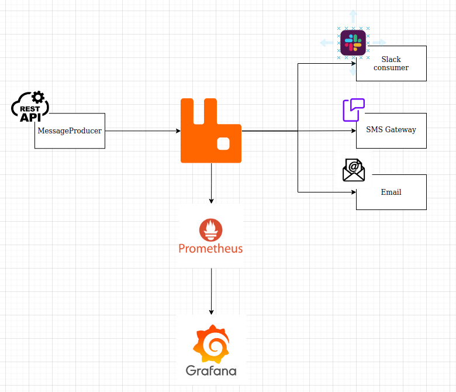

# MessageAPI
Small project for message sending using RabbitMq.

This project allows to receive rest calls and send the messages via RabbitMq to appropriate consumer.
Also there is a Prometheus/Grafana solution for monitoring processes within a queues.

### Tech stack:

- Java 15, Springboot
- RabbitMQ (adminUI, prometheus, delayed queue)
- Docker compose, Grafana, Prometheus
- Slack, Email, SMS channels

### Build:

- To build project and run it go to `scripts` and run script `./buildNrun.sh`. Project will be built, dockerized and started.

### RabbitMq

RabbitMq UI : `localhost:15672`

|  User  |  Login | Password |
| ------ | ------ | ------   |
| Admin  | admin  |  admin   |
| Guest  | quest  |  quest   |

To download bindings, exchanges and queues in separate file:
- Connect to RabbitMq container via shell: `docker exec -it rabbitmq bash`
- Run command : `rabbitmqctl export_definitions /path/to/definitions.file.json`
- Open file with saved definitions and copy content : `cat /path/to/definitions.file.json`

or
- Go to `localhost:15672` and login as admin
- Enter new url : `http://localhost:15672/api/definitions` and copy content

### Prometheus/Grafana

Prometheus UI : `localhost:9090`

Grafana UI : `localhost:3000`

### Architecture

